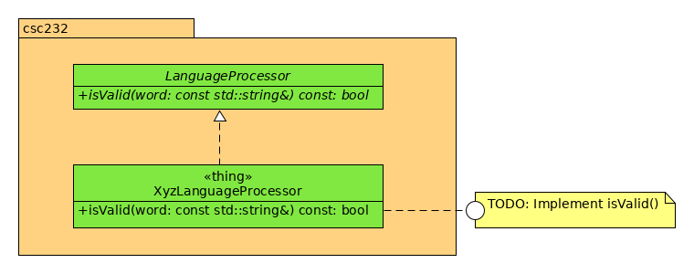

# Hw04 - Language Recognition

This assignment is an adaptation of **Programming Exercise 5.7** found on page 187 of your textbook. The problem statement is repeated here for your convenience.

## Programming Problem 5.7

Implement a recognition algorithm for the language in Exercise 5.

## Exercise 5.5

Consider a language of strings that contains only _X_'s, _Y_'s and _Z_'s. A string in this language must begin with an _X_. If a _Y_ is present in the string, it must be the final character of the string.

This language is specified by the following recursive grammar:

```text
<word> = <X><U> | <X><word> | <X>Y
<U>    = X | Z
<X>    = X
```

## The Adaptation

This assignment is an _adaptation_ of the above exercise/programming problem. You will implement the algorithm in a method of given class.

As shown in the UML class diagram below, your task is to simply implement the language recognition algorithm for the above language (name _XyzLanguage_ in this project).



## Due Date

This assignment is 23:59 Wednesday 27 March 2019.

### Submission Details

Your assignment is to be submitted in the standard process in Teams:

1. Accept the homework assignment using the provided GitHub Classroom URL in the Teams assignment.
1. Once your repo has been created by the above automated process, clone your repo.
1. Create a develop branch within which to do your work.
1. Follow the guidance suggested by the `TODO` annotations in the source files.
1. Create a pull request that seeks to merge the changes in your develop branch into your master branch. Be sure to assign both your instructor (professordaehn) and your GA (joshuaellis555) as reviewers (if not already set by GitHub classroom).
1. "Submit" the assignment in Teams by supplying the URL of your pull request.

**NOTE**: Please DO NOT merge your pull request until I have approved the pull request, or ate least after the assignment has been graded.

### Grading Notes

* Your changes _must_ reside in a branch named `develop` (case sensitive). If your changes are not in that branch, the automation scripts executed by your instructor will fail to execute the unit tests and thus will result in a grade of 0.
* If your test target does not compile, the greatest grade you can receive is 1 (out of 5 points).

|Criterion | Points |
|----------|--------|
|Valid pull request by the due date | 1 |
|Proper, consistent coding style | 1 |
|Program correctness (success with unit tests) | 3 |

**Total possible points**: **5**