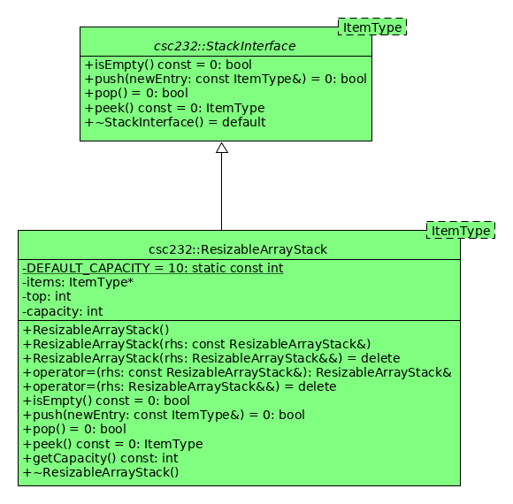

# Hw05 - Resizable Array Stack

This assignment is taken directly from your textbook, namely, **Programming Exercise 7.1** found on page 252. The problem statement is repeated here for your convenience.

## Programming Problem 7.1

Write an implementation of the ADT stack that uses a resizable array to represent the stack items. Anytime the stack becomes full, double the size of the array. Maintain the stack's bottom entry at the beginning of the array.

## Additional Requirements

In addition to implementing the solution as called for, you will also implement several additional methods that are unique to the `ResizableArrayStack` class (i.e., one that isn't inherited from the `StackInterface`). See the UML diagram below for the name of this new method.

### Notes

* Note from the diagram you will implement three of the big-five operations (see HW01 and [Lecture 6](https://github.com/msu-csc232-sp19/lec06-the-big-five)):
    * Copy constructor
    * Copy assignment operator
    * Destructor
* In order for me to test that you've resized your internal array properly, you'll need to expose the capacity of your stack. This is what the `capacity` attribute and `getCapacity()` operation will give me to test that requirement.
* You are expected to implement the `ResizableArrayStack` entirely from scratch; no initial skeletal code will be given to you. So as to prevent compiler errors in the test target due to an un-implemented class, there are no tests included in this project. However, your instructor will have tests to execute and they rely on you creating these classes correctly.
* Note that the `ResizableArrayStack` is expected to be encapsulated in the `csc232` namespace. If they are not, your instructor's test target will not build and you will not be able to earn any more than 2 points (out of a possible 5 points).
* Note that the `ResizableArrayStack` is expected to be a sub-class of the `StackInterface`. If it is not, your instructor's test target will not build and you will not be able to earn any more than 2 points (out a possible 5 points).
* See page 131-132 (C++ Interlude 2) for a discussion on a resizable array-based bag.

## Due Date

This assignment is 23:59 Friday 29 March 2019.

### Submission Details

Your assignment is to be submitted in the standard process in Teams:

1. Accept the homework assignment using the provided GitHub Classroom URL in the Teams assignment.
1. Once your repo has been created by the above automated process, clone your repo.
1. Create a develop branch within which to do your work.
1. Follow the guidance suggested by this README to complete the assignment.
1. Create a pull request that seeks to merge the changes in your develop branch into your master branch. Be sure to assign both your instructor (professordaehn) and your GA (joshuaellis555) as reviewers (if not already set by GitHub classroom).
1. "Submit" the assignment in Teams by supplying the URL of your pull request.

**NOTE**: Please DO NOT merge your pull request until I have approved the pull request, or ate least after the assignment has been graded.

### Grading Notes

* Your changes _must_ reside in a branch named `develop` (case sensitive). If your changes are not in that branch, the automation scripts executed by your instructor will fail to execute the unit tests and thus will result in a grade of 0.
* If your test target does not compile, the greatest grade you can receive is 1 (out of 5 points).

|Criterion | Points |
|----------|--------|
|Valid pull request by the due date | 1 |
|Proper, consistent coding style | 1 |
|Program correctness (success with unit tests) | 3 |

**Total possible points**: **5**
