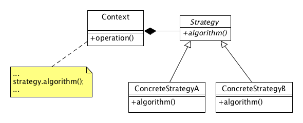
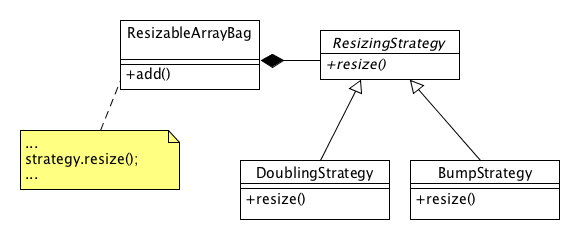
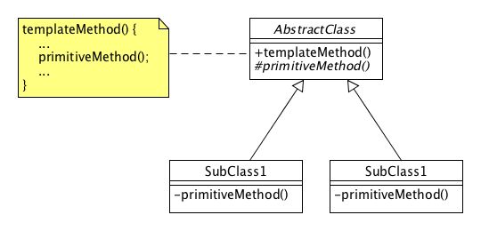

## Lab 4 - An Introduction to Software Design Patterns

In this lab we are introduced to some "Gang of Four" software design patterns. Specifically, upon checkout, this project already contains an example of the _Strategy Pattern_. In this lab your goal is to _refactor_ this code by eliminating duplicity with _Template Method_ pattern.

### Software Design Patterns

A _software design pattern_ is a general, reusable solution to some software design problem; see [Software Design Pattern](https://en.wikipedia.org/wiki/Software_design_pattern). A group of four developers, Erich Gamma, Richard Helm, Ralph Johnson and John Vlissides wrote a book cataloging 23 classic design patterns named **_Design Patterns: Elements of Reusable Object-Oriented Software_**. This book is a classic and is highly recommended. The phrase "Gang of Four" refers to the authors of this book. 

In cataloging these patterns, the "Gang of Four" (GoF) categorized these patterns into three categories:

1. **Creational** - Creational patterns are ones that create objects for you, rather than having you instantiate objects directly. This gives your program more flexibility in deciding which objects need to be created for a given case.
1. **Structural** - These concern class and object composition. They use inheritance to compose interfaces and define ways to compose objects to obtain new functionality.
1. **Behavioral** - Most of these design patterns are specifically concerned with communication between objects.

In this lab, we'll explore two _Behavioral_ patterns:

1. **Strategy** - a pattern that allows one of a family of algorithms to be selected on-the-fly at runtime.
1. **Template Method** - a pattern that defines the skeleton of an algorithm as an abstract class, allowing its subclasses to provide concrete behavior.

#### Strategy Pattern

The general design of the _Strategy_ pattern is shown below:

In this design we see some _Context_ that holds a reference to some (abstract) _Strategy_. When an `operation()` message is sent to this context, it delegates to it's strategy reference. The type of _Strategy_ that the _Context_ owns can be changed at runtime so that different strategies can be employed as necessary. In this lab, we construct a particular _Context_ (namely, `ResizeableArrayBag`) with a particular _Strategy_ reference (e.g., `BumpStrategy` or `DoublingStrategy` which are both kinds of `ResizingStrategy` instances).

In this lab, we have the following classes playing these roles:

Here, the `add()` and `resize()` operations are not shown with their full method signatures for brevity. The idea is simple: We are creating a new subclass of the `Bag` interface named `ResizableArrayBag` which uses a resizable array to store its objects. When we send an `add()` message to some `ResizableArrayBag` that has no room for the new entry, we call upon our resizing strategy to resize the array of objects. The `DoublingStrategy` will double the size of the array when we need more room for objects; the `BumpStrategy` will simply bump the size of the array by one element whenever we need more room.

### Template Method

The general design of the _Template Method_ pattern is shown below:

Here, we have the skeleton of some operation defined in `templateMethod()` which includes calls to one (or more) `primitiveMethod()` operations. The `primitiveMethod()` operation is a pure virtual operation to be defined in some subclass.

See `AbstractClass.h`, `SubClass1.h`, `SubClass2.h` and the end of `Demo.cpp` for a demonstration of this pattern. In so doing, notice that the `primitiveMethod()` is declared as `protected` which effectively makes it private to clients (i.e., users) of this class but effectively public to subclasses. In the subclasses, we can keep the `protected` scope on this method, or make it stricter, i.e., make it `private`. In the UML diagram and the sample code, we choose the latter and make `primitiveMethod()` private in the concrete subclasses of `AbstractClass`. Why do this? Well, the primitive method is just some step in another method (`templateMethod()`) and as such, we don't want clients to have an effect on the way the template method operates. It is the subclass, and only the subclass, that should control the way the template method operates.

## Goal

The source code base for Lab 7 already employs the _Strategy_ pattern and sample code that demonstrates the _Template Method_ pattern. Your goal for this lab is to _refactor_ the classes in the `ResizeableStrategy` class hierarchy so that they realize the _Template Method_ pattern. Here's how:

1. Extract the commonality found in `resize` implementations into the abstract base class `ResizingStrategy`. 
1. Note the one line that's different: the line corresponding to the new size calculation. Extract this out into an abstract method and call it from your `resize()` method (that is now exists only in the `ResizeableStrategy` abstract class).
1. Modify the `DoublingStrategy` and `BumpStrategy` subclasses to implement the abstract method called by your template method (i.e., `resize()`).

## Due Date

There is no due date for this lab. This lab is _not graded_^1 and is distributed just to tap into your own intellectual curiosity.

^1 Well, technically, it will be graded -- everyone that took Quiz 2 during the lab period will receive full credit for this lab.

## Further Exploration

In addition to the task of refactoring this project to employ the _Template Method_ pattern, take a stab at writing some CPPUNIT tests for the classes developed here.

## Additional Notes

This project also marks a change in which we build template, i.e., generic classes. Up until this project, we needed to _not_ include the implementation files of template classes in the build process. Furthermore, our template class specifications (i.e., header files) have used `#include file.cpp`. As mentioned in class, this was but one of three strategies we can use when building template classes into our projects. A disadvantage to this approach is that the IDE cannot provide us with hints as it was not included in the project source sets.

The approach used in this project is to include into the build source sets, another file that has explicit declarations of the template classes we'll actually use so that the compiler can expand them as necessary. There are two advantages to this approach:

1. We can continue developing classes with the class separation of specification and implementation in header and implementation files as we are accustomed. That is, there is no need to use the curious `#include file.cpp` at the end of a header file.
1. Our IDE can now provide hints as the sources are recognized to be part of the build process.

There is one disadvantage to this approach: We must know in advance, the particular implementations we'll need and/or use and declare them in a separate file (see `ExpandedTemplates.cpp`). However, this is a minor inconvenience compared to the advantages gained from this approach.
