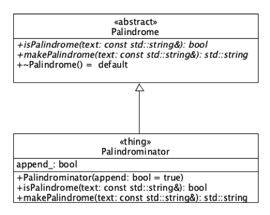

# Lab 08 - Using Stacks and Queues from the STL

In this lab we use the `std::stack<T>` and `std::queue<T>` from the STL to determine whether a string is a palindrome and to generate palindromes. The following UML diagram depicts the classes present in this project.

1. `Palindrome` is an ADT whose contract provides the means to assess a `std::string` for palindrome properties and to generate palindromes from a given `std::string`.
2. `Palindrominator` is a concrete realization of the `Palindrome` ADT. It maintains an attribute that dictates the manner in which an instance generates a palindrome.

## Tasks

You are tasked with implementing the two methods that `Palindrominator` inherits from `Palindrome`. Specifically, when implementing
* `bool isPalindrome(const std::string& text) const` you _must_ use an instance of the STL `stack` and an instance of the STL `queue`
* `std::string makePalindrome(const std::string &text) const` you will generate a palindrome from the given text parameter by one of two ways:
    * if `append_` is true, then you will append the reverse of the given text to the given text, e.g., if text = "abc", then the reverse of this is "cba", which when appended to the original text is "abccba" which of course, is a palindrome.
    * If `append_` is false, then you will _prepend_ the reverse of the given text to generate a palindrome, e.g., if text = "abc", the the reverse of this is "cba", which when prepended to the original text yields "cbaabc" which again, is a palindrome.
    
The test target contains 14 tests that will assess the correctness of your solution.

As usual, after accepting the GitHub Classroom assignment that is used to create this repo, clone it and create a develop branch within which to do your work. You should commit your changes, minimally, with the implementation of each method found in `Palindrominator.cpp`; more commits are encouraged.

Once you have made your final commit, create a pull request and add the URL of your repo to the Teams assignment resource; this is your act of submitting your assignment.

## Due Date

This lab assignment is due by 5:00 PM, 09 April 2019.